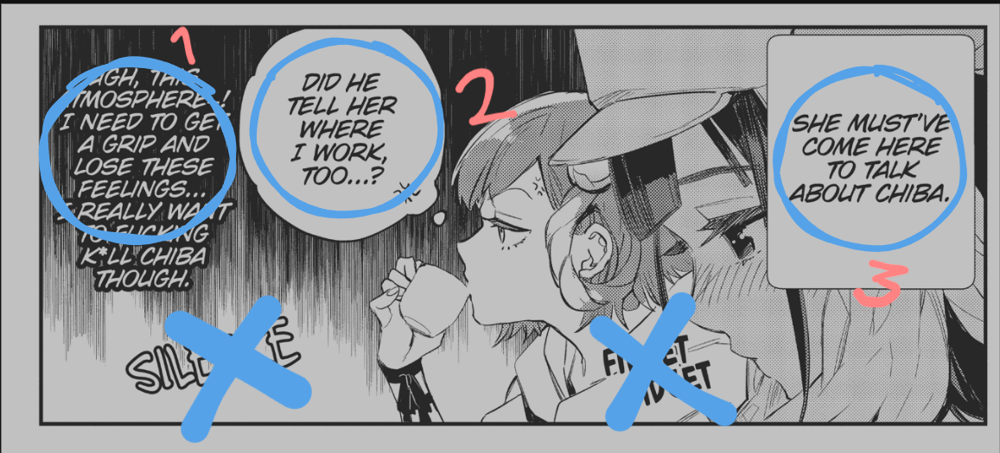

# ✏️ Translator

> **Menerjemahkan komik dari bahasa asing ke Indonesia dengan akurat dan natural**

Translator adalah tulang punggung dari sebuah scanlation. Tanpa terjemahan yang baik, pembaca tidak akan bisa menikmati cerita dengan maksimal. Posisi ini membutuhkan pemahaman mendalam terhadap kedua bahasa dan kemampuan mengadaptasi konteks budaya.

## 📊 Spesifikasi Posisi

::: details 📈 **Tingkat Kesulitan: Sedang**
Memerlukan kemampuan bahasa yang baik dan pemahaman konteks budaya. Tidak hanya menerjemahkan kata-kata, tapi juga nuansa dan feeling dari dialog original.
:::

::: details ⏱️ **Estimasi Waktu: 1-2 Hari/Chapter**
Waktu dapat bervariasi tergantung:
- Panjang chapter (15-30 halaman)
- Kompleksitas dialog dan terminology
- Penelitian referensi yang dibutuhkan
- Tingkat kesulitan bahasa sumber
:::

::: details 📄 **Format Pengumpulan: *.txt**
File teks sederhana yang mudah dibaca dan diedit oleh semua tim. Format yang universal dan tidak memerlukan software khusus.
:::

## :star: Kriteria Ideal Seorang Translator :star:

Sebagai satu-satunya translator dalam proyek scanlation, kamu harus memiliki kemampuan yang komprehensif dan bisa menangani berbagai aspek penerjemahan secara mandiri.

::: info 📝 **Kemampuan Penerjemahan Akurat**
Mampu menerjemahkan percakapan, monolog internal, narasi, dan teks lainnya dari bahasa sumber (umumnya Jepang, Inggris, atau China) ke bahasa Indonesia yang natural dan mudah dipahami.

**Indikator:** Terjemahan terasa seperti ditulis asli dalam bahasa Indonesia, tidak kaku atau aneh.
:::

::: info 🗣️ **Skill Adaptasi Dialog**
Pandai menyesuaikan panjang dialog agar sesuai dengan ukuran bubble tanpa mengurangi makna. Bisa membuat dialog pendek tapi tetap powerful dan bermakna.

**Indikator:** Dialog pas di bubble, tidak terpotong atau terlalu sesak, tapi tetap menyampaikan emosi yang sama.
:::

::: info 🎭 **Kepekaan Budaya & Localization**
Memahami konteks budaya kedua bahasa dan bisa mengadaptasi referensi, idiom, atau joke yang tidak familiar bagi pembaca Indonesia dengan cara yang natural.

**Indikator:** Pembaca Indonesia bisa relate dengan humor dan referensi, tanpa kehilangan essence cerita original.
:::

::: info 🔍 **Konsistensi & Manajemen Project**
Mampu menjaga konsistensi terminologi, nama karakter, dan gaya bahasa sepanjang series. Terorganisir dalam membuat dan memelihara glossary pribadi.

**Indikator:** Nama karakter, skill, dan istilah khusus konsisten dari chapter 1 sampai terakhir.
:::

## ⚙️ Teknis Pengerjaan

### 💬 Sistem Bubble Dialog

Manga diterjemahkan per unit bubble dialog - setiap kotak percakapan diterjemahkan secara individual untuk menjaga flow cerita yang natural.



::: tip 🎯 **Jenis Teks yang Diterjemahkan**
- **Dialog karakter** - Percakapan antar karakter
- **Monolog internal** - Pikiran dalam hati karakter  
- **Narasi** - Teks penjelasan cerita
- **Sign text** - Tulisan pada papan, poster, dll (opsional)

**❌ Yang TIDAK diterjemahkan:**
- Sound effect (SFX) seperti "BOOM!", "クラッ", dll
- Onomatopoeia yang bersifat universal
:::

### 📋 Format & Standar Pengumpulan

::: details 📄 **Template File .txt**
```
JUDUL: [Nama Manga] (contoh: Mahou Shoujo ni Akogarete)
CHAPTER: [Chapter] (contoh: Ch. 10)
TRANSLATOR: [Nama Kamu] (contoh: Faralha)
DATE: [Tanggal] (contoh: 17 Agustus 2025)

HAL. 1 (bisa juga ditulis hanya 1, 01, dll bebas)
hi: hai, senang bertemu denganmu
hi: hai, ...

HAL. 2
we: Kita kudu berangkat sekarang
```
:::

::: warning ⚠️ **Aturan Wajib**
- ✅ **Gunakan format .txt** - Universal dan mudah dibuka
- ✅ **Beri header lengkap** - Judul, nama translator, tanggal
- ✅ **Penanda halaman jelas** - `HAL. 1`, `Hal. 2`, atau `Page 1`
- ✅ **Urutan baca manga** - Kanan ke kiri, atas ke bawah
- ✅ **Penggalan kata pembuka** - 2-3 kata pertama sebagai penanda
- ✅ **Jaga tanda baca** - Jangan hilangkan "!", "?", "..." dari original
:::

## 📖 Contoh Hasil Terjemahan

### 🇬🇧➡️🇮🇩 English to Indonesian

::: details 📄 **Assassin Ch. 10.txt**
```
Assassin and Cinderella
Ch. 10
TL: Faralha

1
(tidak ada teks)

2
let’s: mari kita akhiri pernikahan kontrak ini.
i want: aku ingin menikahimu dengan asli kali ini…
and make: dan membuatmu jadi wanita paling bahagia di dunia.

3
marry: menikah…
for real: beneran…?
what: apa…
are: yang kau…
saying: bicarakan…
huh?
amai-san!
where: mau kemana kita…?

```
:::


::: details 💡 **Analisis Terjemahan EN-ID**
Terjemahan dari English ke Indonesian umumnya lebih straightforward karena:
- Struktur kalimat yang relatif mirip
- Banyak kosakata serapan yang sudah familiar
- Konteks budaya Barat yang sudah banyak dikenal

**Tips:** Fokus pada naturalisasi bahasa agar tidak terasa kaku atau Google Translate.
:::

### 🇯🇵➡️🇮🇩 Japanese to Indonesian  

::: details 📄 **Gunbured Ch. 16.txt**
```
Gunbured x Sisters
Chapter 16 嫌な予感　・　 Firasat Buruk
TL ria

1
第165話+嫌な予感: Chapter 16 - Firasat Buruk
教皇様。: Bapa Suci.
ムラヴ様の: Mrav-sama telah tiba.
やあやあ: Apa kabar Bapa Suci~?
つい先日ぶり: Baru kemarin kita bertemu~
騒々しいのは: Sebetulnya aku tidak suka keramaian...
燃え逝く命の灯は: Tapi bisa melihat api kehidupan padam... sungguh pemandangan yang mempesona.
これを肴に: Bagaimana kalau kita nikmati dengan sebotol rum?

2
貴様の悪趣味に: Aku tak sudi menemanimu menikmati perbuatan dosa.
それよりも: Yang lebih penting, bukannya kalian sendiri yang berjanji akan menjauhkan mereka dari kota?
無論: Tenang saja. Kami bukannya lupa.
かつては同じ: Dulunya seluruh vampir memang bergerak dengan tujuan kemakmuran spesies kami...
それ故に: Tapi sepertinya pembelot mulai bermunculan.
なあに: Loh loh, jangan tegang begitu~
古き盟約は: Perjanjian Kuno tetap akan berjalan
君たち教団を: Kami tidak akan membiarkan kalian lenyap kok.
本気になれば: Santai saja. Sekali vampir darah murni serius, kami tidak terkalahkan♥
```
:::

::: details 🌸 **Analisis Terjemahan JP-ID**
Terjemahan dari Japanese memiliki tantangan khusus:
- **Honorifics** - san, kun, chan, senpai (pertahankan atau adaptasi?)
- **Keigo** - Tingkat kesopanan dalam bahasa Jepang  
- **Konteks budaya** - Festival, makanan, tradisi Jepang
- **Partikel** - wa, ga, wo yang tidak ada padanannya

**Tips:** Pahami konteks situasi dan hubungan antar karakter untuk menentukan register bahasa yang tepat.
:::

::: tip 🎯 **Penanda Dialog**
Gunakan **2-3 kata pertama dari teks original** sebagai penanda untuk memudahkan typesetter menemukan lokasi teks yang tepat di halaman manga.

**Contoh:**
- `Hello, how are you?` → `Hello: Hai, apa kabar?`
- `おはよう` → `おはよう: Selamat pagi`
:::

## ✅❌ Best Practices & Common Mistakes

### ✅ **Yang HARUS Dilakukan**

::: tip 📝 **1. Terjemah per Kalimat Utuh**
**✅ Benar:** Terjemahkan sebagai satu kesatuan kalimat yang lengkap
- "I'm going to the store" → "Aku mau ke toko"

**❌ Salah:** Terjemah kata per kata  
- "I'm" = "Aku adalah", "going" = "pergi", "store" = "toko"

Konteks kalimat utuh memberikan makna yang tepat dan natural.
:::

::: tip 🎭 **2. Pahami Konteks Cerita**
- **Situasi:** Apakah sedang tegang, romantis, atau comedy?
- **Karakter:** Bagaimana personality dan cara bicara tokoh?
- **Hubungan:** Formal, casual, atau intimate relationship?
- **Setting:** Modern, fantasy, historical, sci-fi?

**Contoh:** "Baka" bisa jadi "Bodoh", "Dasar", "Aduh kamu", tergantung konteks.
:::

::: tip 🔍 **3. Riset & Referensi Mendalam**
**Sumber yang Recommended:**
- 🌐 **Google Translate** - Referensi awal, jangan langsung copas
- 📚 **Kamus Online** - KBBI, Jisho.org untuk Japanese
- 📖 **Wiki Series** - Pahami world-building dan terminologi
- 🎮 **Official Release** - Cek terjemahan resmi jika ada
- 👥 **Community Forums** - Reddit, MyAnimeList discussions

**Contoh Kasus:** Nama karakter sering berbeda antar region  
`Celestia (Global) ≠ Xinghui (CN) - gunakan yang familiar bagi pembaca Indonesia`
:::

::: tip 🎯 **4. Konsistensi Terminologi**
Buat **glossary pribadi** untuk:
- Nama karakter dan tempat
- Skill/jutsu/ability names  
- Istilah teknis dunia cerita
- Honorifics dan panggilan
:::

### ❌ **Yang HARUS Dihindari**

::: danger 🚫 **1. Word-by-Word Translation**
Terjemahan literal kata per kata menghasilkan:
- Kalimat kaku dan tidak natural
- Hilangnya nuansa emosi
- Grammar bahasa Indonesia yang salah
- Pembaca bingung dan tidak nyaman baca
:::

::: danger 🤖 **2. Google Translate Mentah-mentah**
Google Translate boleh sebagai **referensi awal**, tapi:
- Sering salah konteks dan nuansa
- Tidak paham culture reference
- Grammar dan natural flow masih kaku
- Tidak konsisten dengan terminologi series

**Always do manual editing dan adaptation!**
:::

::: danger 😵 **3. Mengabaikan Konteks**
Kesalahan fatal yang sering terjadi:
- Tidak paham relationship antar karakter
- Salah interpretasi mood scene
- Menggunakan register bahasa yang salah
- Tidak konsisten dengan personality karakter
:::

::: danger ⏰ **4. Terburu-buru & Tidak Proofread**
- Typo dan kesalahan ketik
- Inconsistent naming/terminology  
- Dialog cut off atau terlalu panjang untuk bubble
- Tidak sesuai dengan character limit
:::

## 🏆 Tips Pro Translator

::: info 💡 **Mindset yang Tepat**
Jangan hanya jadi "penerjemah" - jadilah **"penulis ulang cerita"** dalam bahasa Indonesia. Tujuannya adalah pembaca Indonesia merasakan experience yang sama dengan pembaca bahasa original.
:::

::: info 🎨 **Adaptasi Kreatif**  
- **Jokes/Puns:** Ubah ke humor yang relatable buat Indonesia
- **Cultural References:** Ganti dengan yang familiar (tapi jangan berlebihan)
- **Idioms:** Gunakan peribahasa Indonesia yang setara makna
- **Onomatopoeia:** Sesuaikan dengan SFX Indonesia jika perlu
:::

## 🚀 Memulai Karir sebagai Translator

### 📚 **Skill yang Perlu Dikembangkan**

::: details 🌐 **Kemampuan Bahasa**
**Bahasa Sumber (minimal salah satu):**
- 🇯🇵 **Japanese** - Untuk manga/light novel Jepang (paling umum)
- 🇬🇧 **English** - Untuk manhwa/manhua yang sudah diterjemahkan ke EN
- 🇨🇳 **Chinese** - Untuk manhua original
- 🇰🇷 **Korean** - Untuk manhwa original

**Bahasa Target:**
- 🇮🇩 **Bahasa Indonesia** - Harus fasih dan natural, pahami ragam formal-informal
:::

::: details 📖 **Pengetahuan Budaya Pop**
- **Anime/Manga Terminology** - Istilah umum yang sudah diadopsi fans
- **Gaming Terms** - Skill, stats, RPG elements  
- **Internet Slang** - Meme dan bahasa anak muda yang relevan
- **Cultural Context** - Tradisi, makanan, sistem sekolah, dll
:::

::: details 🔧 **Tools & Software**
- **Text Editor** - Notepad++, VS Code, atau yang nyaman
- **Dictionary Apps** - Jisho.org, Google Translate, KBBI
- **Image Viewer** - Untuk melihat raw manga sambil translate
- **OCR Software** - Untuk extract text dari image (opsional)
:::

### 🎯 **Cara Bergabung dengan Tim Scanlation**

1. **📝 Apply di Tim yang Rekrut**
   - Cek forum, Discord server, atau social media grup scanlation
   - Siapkan portofolio terjemahan sample (2-3 halaman)
   - Tunjukkan konsistensi dan kualitas kerja

2. **🎪 Mulai dari Oneshot**
   - Ambil project kecil untuk membangun reputation  
   - Oneshot lebih mudah untuk pemula dan less commitment
   - Gunakan sebagai learning experience

3. **🤝 Networking**
   - Join komunitas translator Indonesia
   - Kolaborasi dengan translator lain untuk saling belajar
   - Aktif di forum diskusi manga/manhwa

### 💰 **Penghasilan & Monetisasi**

::: warning 💡 **Realitas Finansial**
**Scanlation umumnya bersifat volunteer/hobbyist**, tapi ada beberapa kemungkinan:

- 🎁 **Donation-based** - Reader yang appreciate bisa donasi
- 💼 **Freelance Official** - Publisher resmi kadang hire fan translator  
- 🏢 **Professional Path** - Jadi stepping stone ke industri penerjemahan
- 📚 **Commission Work** - Translate light novel atau doujin berbayar
:::

### 🏅 **Jenjang Karir Translator**

```
📝 Newbie Translator
    ↓
🎯 Experienced Translator  
    ↓
👑 Lead Translator (manage tim, QC hasil translator lain)
    ↓  
🎪 Translation Coordinator (koordinasi multiple project)
    ↓
💼 Professional Translator (official publisher)
```

## 🎭 Pesan Penutup

> **"Great translation is invisible - pembaca tidak sadar sedang membaca terjemahan karena terasa natural seperti ditulis langsung dalam bahasa mereka."**

Menjadi translator bukan hanya soal kemampuan bahasa, tapi juga **empathy** untuk memahami karakter, **creativity** untuk adaptasi budaya, dan **dedication** untuk memberikan experience terbaik bagi pembaca.

Setiap chapter yang kamu terjemahkan adalah jembatan yang menghubungkan dunia cerita dengan ribuan pembaca Indonesia. **Keep learning, stay passionate, dan nikmati prosesnya!** 

::: tip 🌟 **Ready to Start?**
Mulai dengan project kecil, fokus pada kualitas daripada quantity, dan jangan takut bertanya ke translator senior. Everyone starts somewhere - yang penting adalah **konsistensi dan passion** untuk terus berkembang!
:::